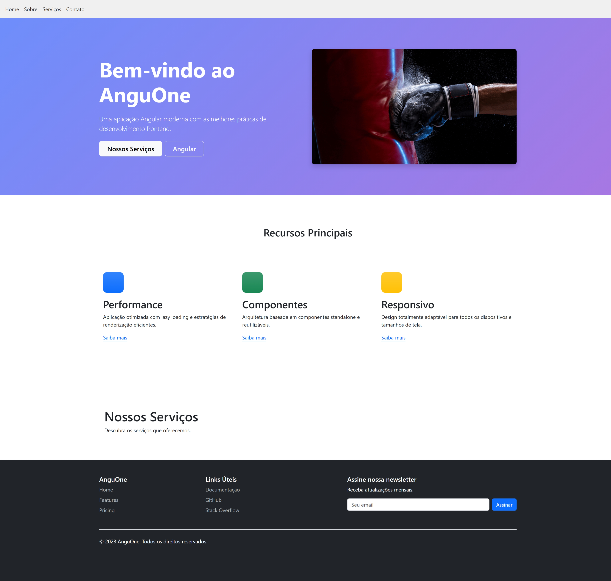

# AnguOne - Aplicação Angular Moderna

[](https://angular.io/)
[](https://material.angular.io/)

Projeto desenvolvido com Angular CLI version 20.0.3, implementando as melhores práticas de desenvolvimento frontend.

## Recursos

- **Performance otimizada**: Lazy loading e estratégias de renderização eficientes
- **Arquitetura moderna**: Componentes standalone e reutilizáveis
- **Design responsivo**: Adaptável para todos os dispositivos e tamanhos de tela
- **Angular Material**: UI components seguindo Material Design



### Componentes Principais

- **Contact Module**: Implementado com Angular Material para formulários de contato

## Começando

### Pré-requisitos

- Node.js (versão 18 ou superior)
- npm (normalmente vem com Node.js) ou yarn
- Angular CLI (`npm install -g @angular/cli`)

### Instalação

1. Clone o repositório:

   ```bash
   git clone https://github.com/seu-usuario/AnguOne.git
   ```

2. Instale as dependências:

   ```bash
   cd AnguOne
   npm install
   ```

3. Inicie o servidor de desenvolvimento:

   ```bash
   ng serve
   ```

4. Acesse no navegador:
   ```
   http://localhost:4200/
   ```

---
